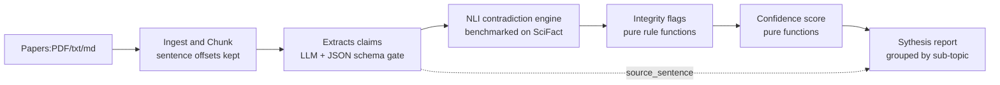

# A_Researcher

#### Not Summarizing, but Cross-examining papers!

Given Papers/ Collection of papers on the same topic, and it will pull out made empirical claims, and then identify support claims and contradictions (if any) using NLI model (Not simply repurposed or specialized LLM).

Flag the threat to validity which a careful reviewer will look for, and hand back a confidence-score report with claims linked to the exact sentences they came from.

## The Problem

As much as AI models have become all-purpose they often lack in the same things, for example, Generalization at the expense of Specialization.

Ask any LLM to summarize what the research paper says about something, and it will respond with confidence an answer comprising of assortment of actual truth of the paper, supporting findings, contradictory statements, and not to mention if any - hallucination, with no way to tell them apart. 

LLM, Hardware and Agents deployed for all intense and purposes only change how **Educated** the **Guess** is.

## What This Does Instead

1. **EXTRACT** - Pull individual claims out of papers as structured data.
2. **VERIFY** - Run all claims by a pre-trained **NLI classifier** (`entailment / contradiction / neutral`), and benchmark against **SciFact**.
3. **FLAG** - Rules-based integrity checks.
4. **SCORE** - Transparent, Deterministic, confidence formula.
5. **SYNTHESIZE** - A Structured report per subtopic - support, dissent, flags, verdict, with exact sources.

## Key Point
Contradiction detection is an NLI classifier and never an LLM prompt. That's what makes this benchmarkable, and it's the whole reason this isn't just another summarizer wrapper.

## Architecture

One Monolithic FastApi service.
JSONL document store, No Queues, No Vector DB, No Training - inference only.

---
## TECH STACK

| Layer | Choice | Why |
|---|---|---|
| Backend | FastAPI + Pydantic v2 | Free Interactive API docs, schema gate for LLM output |
|Contradiction Detection | Pretrained NLI classifier (DeBERTa-v3 zeroshot / SciFact-tuned)| Deterministic, Benchmarkable, ~500mb |
Pair Reduction|'all-MiniLM-L6-v2' embeddings + clusteringg|O(n²) → tractable |
Claim extraction |LLM  (API/Local)+Json Schema gate retry <= 2|Judgement Task, but shape is guaranteed automatically|
|Scoring and Flags|Pure Python functions|Explainable, zero LLM guessing|
|Storage|JSONL|Prototype scope, Scalable for future
